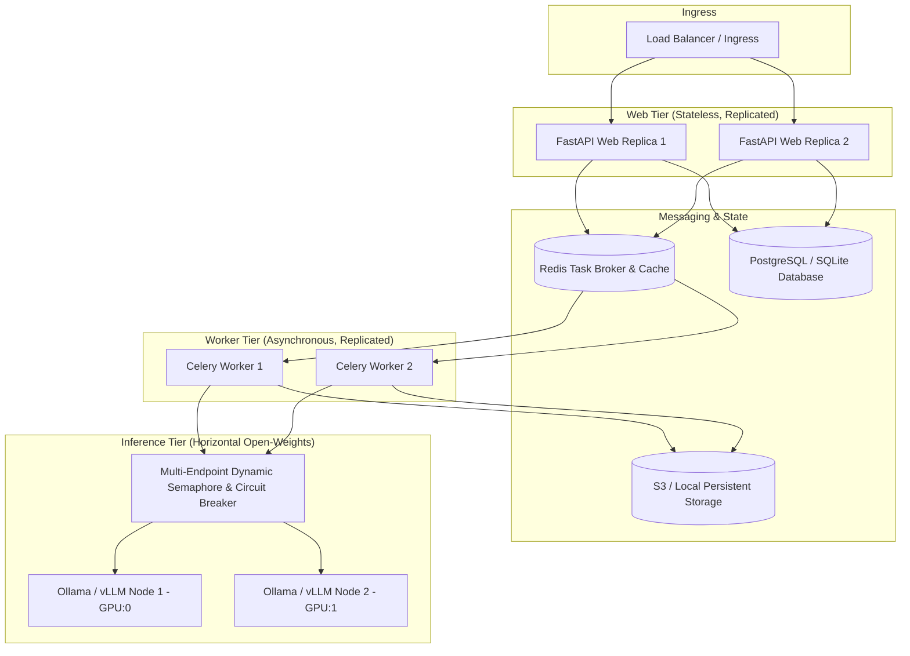

# Walkthrough: HireTrace Production & Scale Upgrade

HireTrace has been upgraded from a single-machine hackathon prototype into a horizontally scalable, fault-tolerant, multi-tenant enterprise system while strictly preserving its core identity: **$0.00 zero-paid-API inference**, **DEGRADED-state integrity**, **4-agent pipeline boundaries**, **2D quadrant evaluation**, and **no autonomous hire/no-hire decisions**.

---

## Architecture Overview

---

## Key Changes by Phase

### Phase 0 — Guardrails & CI Baseline
- **GitHub Actions Workflow**: Added `.github/workflows/ci.yml` running unit and integration tests with `HIRETRACE_OFFLINE_MOCK=1`.
- **Requirements & Dependencies**: Added `httpx>=0.27.0` to `requirements.txt` to ensure `fastapi.testclient.TestClient` installs and executes cleanly in fresh CI environments.
- **Coverage Configuration**: Configured `pytest.ini` with test coverage flags reporting on `agents` and `ui`.
- **Smoke Tests**: Created `tests/smoke_test_endpoints.py` verifying all existing endpoint contracts.

### Phase 1 — Web Layer: FastAPI & Uvicorn ASGI
- **Modern ASGI App**: Replaced stdlib `http.server` in `ui/server.py` with FastAPI + Uvicorn.
- **Contract Compatibility**: Preserved all endpoints (`/api/candidate/new`, `/api/evaluate/{id}`, `/api/candidate/{id}/status`, `/api/cases`, `/api/case/{id}/full`, `/api/eval_summary`, `/api/eval_results`, `/api/batch/{id}/status`).
- **Health & Readiness**: Added `/healthz` (liveness) and `/readyz` (readiness probing DB and LLM connectivity).
- **Multi-Worker Dockerfile**: Updated `Dockerfile` to run with `uvicorn --workers N`.
- **Structured Access Logs**: Structured JSON logging capturing method, path, status, latency, and candidate_id.

### Phase 2 — Database Single Source of Truth
- **Split-Brain Removal**: Completely eliminated `ALL_CASES` in-memory global list from read and write paths. Database (`agents/db.py`) is the single source of truth.
- **Worker & Handler Decoupling**: Request handlers and background evaluation workers no longer mutate shared in-process lists; all state transitions write directly to SQLite/Postgres.
- **Throttled Status Polling**: Implemented thread-safe `STATUS_CACHE = TTLCache(maxsize=2000, ttl=5)` to prevent DB thundering herds during rapid frontend polling.

### Phase 3 — Distributed Task Queue & Independent Workers
- **Celery + Redis Broker**: Configured Celery in `agents/tasks.py` with `acks_late=True` and `task_reject_on_worker_lost=True`.
- **Hybrid Job Manager**: `agents/job_manager.py` persists state to the `JobQueue` DB table, dispatching to Celery when Redis is reachable and falling back gracefully to in-process workers in local zero-config mode.
- **Dedicated Worker CLI**: Created `worker.py` for running isolated worker processes.
- **Service Decoupling**: Updated `docker-compose.yml` and `docker-compose.prod.yml` with distinct `web`, `worker`, `redis`, `postgres`, and `ollama` services.

### Phase 4 — Unblocking LLM Concurrency Ceiling
- **Multi-Endpoint Load Balancing**: `agents/ollama_client.py` supports comma-separated `OLLAMA_BASE_URLS` with least-loaded connection routing.
- **Hermetic Mock vs Custom Port Detection**: Explicit custom endpoint URLs (such as test ports like `http://127.0.0.1:59999`) are actively probed rather than being mistakenly classified as mock backends under `HIRETRACE_OFFLINE_MOCK=1`, preserving the safety-critical DEGRADED fallback integrity.
- **Dynamic Capacity Sizing**: Semaphore permits scale dynamically:
  $$\text{Capacity} = N_{\text{endpoints}} \times \text{CONCURRENCY\_PER\_ENDPOINT}$$
- **Per-Endpoint Circuit Breaker**: Tracks consecutive failures with cooldown timeouts and half-open probing.
- **Load Test Benchmark**: Created `eval/load_test.py` demonstrating throughput scaling when adding a second endpoint.

### Phase 5 — Modernized Retrieval & Persistent Embedding
- **Pluggable Embedders**: Added `SentenceTransformerEmbeddingModel` (`all-MiniLM-L6-v2`) and `OllamaEmbeddingModel` (`nomic-embed-text`) with zero-download lexical fallback (`HashedLexicalEmbeddingModel`) in `agents/retrieval_layer.py`.
- **Auto-Selection**: In `auto` mode, neural sentence embeddings are automatically utilized when installed, gracefully falling back to deterministic lexical embeddings.
- **Persistent Vector Cache**: `agents/embedding_cache.py` persists `.npz` vector matrices by SHA256 document hash, eliminating redundant embedding on re-evaluation.
- **Batch Embeddings**: Added `batch_embed_across_candidates()` for efficient bulk candidate ingestion.

### Phase 6 — Multi-Tenant Security & Input Validation
- **Multi-Tenant Scoping**: Database models in `agents/db.py` enforce `tenant_id` isolation.
- **Authentication & Authorization**: `agents/security.py` implements API key auth (`X-API-Key`, `Bearer`) with tenant enforcement (HTTP 401/403).
- **Secure by Default in Prod**: Configured `HIRETRACE_REQUIRE_AUTH=1` and `HIRETRACE_API_KEY` by default in `docker-compose.prod.yml`.
- **Sliding-Window Rate Limiting**: Token-bucket / sliding window rate limiter protects LLM evaluation endpoints (HTTP 429).
- **Pydantic Validation**: Strict Pydantic models for candidate creation and batch requests.
- **Security Guide**: Authored `docs/SECURITY.md` covering PII sanitization and volume encryption.

### Phase 7 — Observability & Prometheus Metrics
- **Prometheus Metrics**: Added `/metrics` endpoint exposing queue depth, active jobs, pipeline latency histograms, and LLM telemetry counters.
- **Structured JSON Agent Events**: Added `log_agent_event()` logging agent name, candidate_id, duration, and outcome across all pipeline stages in `agents/pipeline.py`.
- **Observability Guide**: Authored `docs/OBSERVABILITY.md` with complete PromQL queries and Grafana dashboard layout.

### Phase 8 — Durability, Storage & Migrations
- **Storage Abstraction**: Created `agents/storage.py` supporting `LocalStorageProvider` (atomic writes, path traversal prevention) and `S3StorageProvider`.
- **Alembic Migrations**: Fully initialized Alembic configuration with `alembic/versions/001_initial_schema.py` supporting both SQLite batch migrations and PostgreSQL.
- **Named Volumes**: Ensured all trajectories, uploads, and data directories persist in named Docker volumes across container teardowns and deployments.

### Phase 9 — Quality & Model Taxonomy
- **Curated Taxonomy JD Generation**: Replaced brittle keyword matching with `agents/jd_templates.py`, supporting structured roles (Backend, Frontend, Fullstack, ML/Data, DevOps, Mobile, Security) with graceful generic fallback.
- **Reproducible Evaluation CLI**: Extended `eval/run_eval.py` with `--model` and `--output` flags to evaluate any open-weights model against the 15-case benchmark.
- **Transparent Sizing Report**: Updated `eval/eval_report.md` Section 6 to clearly separate empirical measurements (`qwen2.5:3b` in `eval/eval_results.json`) from GPU/VRAM hardware sizing targets for larger tiers (`qwen2.5:7b`, `llama3.1:8b`).

---

## Deliverables

1. `walkthrough.md`: This comprehensive overview of system architecture, phase deliverables, and verification.
2. `SCALING.md`: Horizontal scaling handbook, tier sizing rules ($N$ workers $\times$ $M$ LLM endpoints), bottleneck diagnosis, and PromQL monitoring.
3. `README.md`: Updated "Deployment Modes" detailing local zero-config, single-container, and distributed multi-worker topologies.
4. `docker-compose.yml` & `docker-compose.prod.yml`: Production-ready compose configurations with healthchecks, named volumes, auth enabled by default, resource constraints, and independent worker scaling.
5. `docs/SECURITY.md` & `docs/OBSERVABILITY.md`: Security posture and metric visualization documentation.
6. `eval/load_test.py`: Reproducible multi-endpoint concurrency benchmarking artifact.
